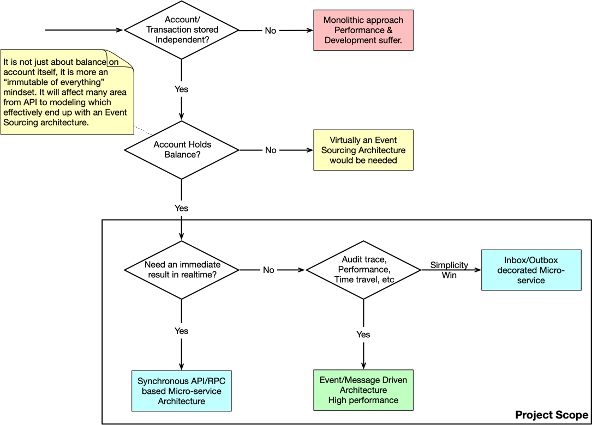

# Architecture Document

## Deployment Architecture

The deployment architecture of the Real-Time Balance application is shown in the following diagram.

## Key Architecture Decisions Records

There are severa key questions to be answers before we come to a rational decision on this realtime balance calculation system.

* **Should Account & Transaction Data be split** into different database and served by independent service?
* **Should Account Entity holds a balance?**
* **Is an immediate result needed in response.**
* **Favor audit trace, time travel, etc.**

By evaluating and answering these questions, the decisions can be summarized into diagram bellow. 

## Design Factors Analysis

### Data & Service granularity

There are, at minimum, two relevant business data entities in this system, account (bank account) and transaction. 
They could be held by a single service or one for each, there are several considerations to decide how many services or 
databases should be used.

* **Data volume** and potential growth over time. 
* **Data classification**, which affect data ownership, sensitivity and regulation control.

| Entity      | Data Volume                                        | Data Classification                                                    | Data Sensitivity                                 |
|-------------|----------------------------------------------------|------------------------------------------------------------------------|--------------------------------------------------|
| Account     | Grows in proportion to registered user.            | Belongs Master Data. Would be needed all the time by various services. | Sensitive for sure (bank account no).            |
| Transaction | Grows in proportion to registered user times time. | Belongs Transaction Data. Old data could be archived.                  | Less sensitive especially when it is anonymized. |

The differences identified are strong enough to separate account & transaction data apart. As the following figure shows.

### Instant Result on Response

In most cases, the caller would definitely need to know if there were sufficient balance for the transaction. 
So that we'd need an instant result of the transaction and get the remaining balance.

But if the balance was about a book in ledger system, an instant response may not be always needed as in most cases,
people would be more interested to the final result with all transactions fully processed. 

Depending on whether instant result is needed, there can be two different communication protocols.

* **Sync Response**: Caller will get a result in response, including balance and status is usually `Completed`.
* **Async Response**: Caller will only get a receipt of the request. Final result are delivered asynchronously via message or callback.

The following figure may explain the differences between the two approaches.

### Holds Balance on Account or Not?

Holding a `balance` field on `Account` entity is a common approach because the balance is so crucial and frequently accessed. 
But actually, balance can also be calculated by aggregating all transactions belongs to an account at the cost of extra CPU and IO resources.
The resources requirement can be reduced by taking snapshots periodically. 
Then the current balance would only need transactions of the past 24 hours with a snapshot of yesterday.

The choice would impact the model and even system architecture, the table below may illustrate some key aspects.

| Aspect                      | Account Holds Balance                      | Account NOT holds Balance                       |
|-----------------------------|--------------------------------------------|-------------------------------------------------|
| **Distributed Transaction** | Yes, Transaction with Account Balance.     | No. (within scope of Account/Transaction)       |
| **Need for Snapshot**       | No (no for balance calculation)            | Yes (to speed up balance calculation)           |
| **Storage Choice**          | Rational Database with Transaction Support | Append-only distributed Storage with Consensus. |

The data processing flow would be different too, as the following diagram shows.

In this project, we choose the approach of account holds balance for mature tech stack. 

### Inbox vs Message Broker

This question only stands when asynchronous response is chosen. Then we need to decide how to handle the request in an asynchronous manner.

There are two typical approaches, inbox and message broker.

* **Inbox**: The request is stored in a queue-like structure, and the service will poll the inbox for new requests.
* **Message Broker**: The request is sent to a message broker, and the service will subscribe to the message broker for new requests.

The choice would affect the system architecture and the way of communication, the table below may illustrate some key aspects.

| Aspect                     | Inbox                                    | Message Broker          |
|----------------------------|------------------------------------------|-------------------------|
| **Request Storage**        | Database                                 | Message Broker          |
| **Performance**            | Low (Similar to API based 1000-2000 TPS) | High (4000-6000 TPS)    |
| **Compensation Mechanism** | Periodical Job                           | Nearly realtime         |
| **Scalability**            | Vertical (Database)                      | Horizontal (Partition)  |

The following diagram may illustrate the differences between the two approaches.

