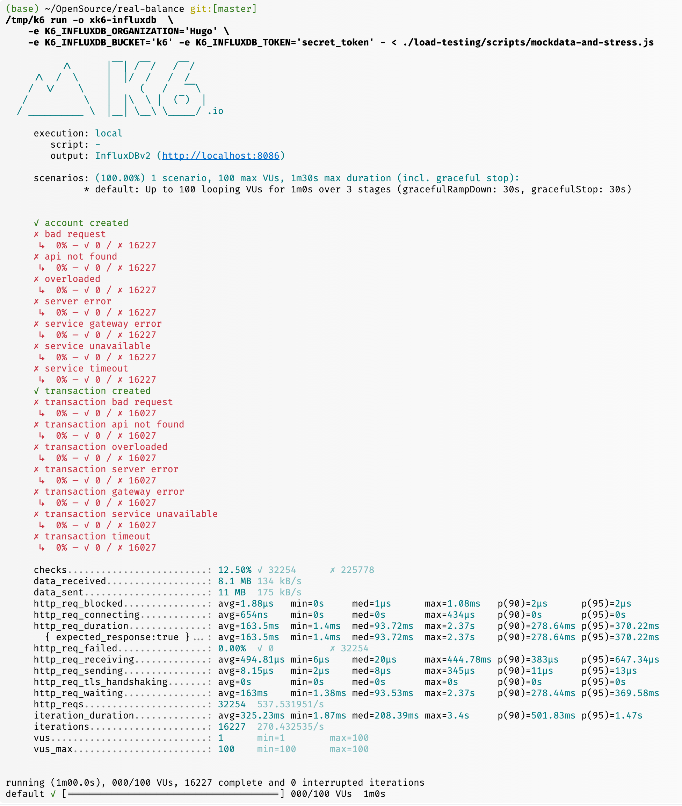
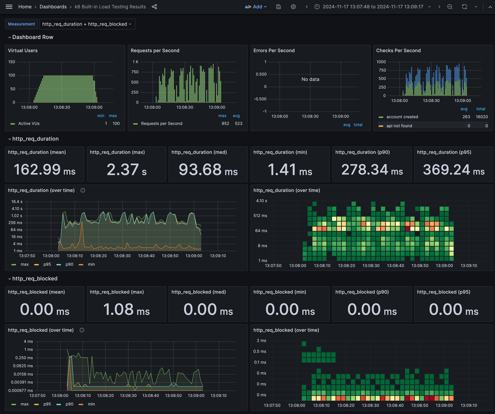
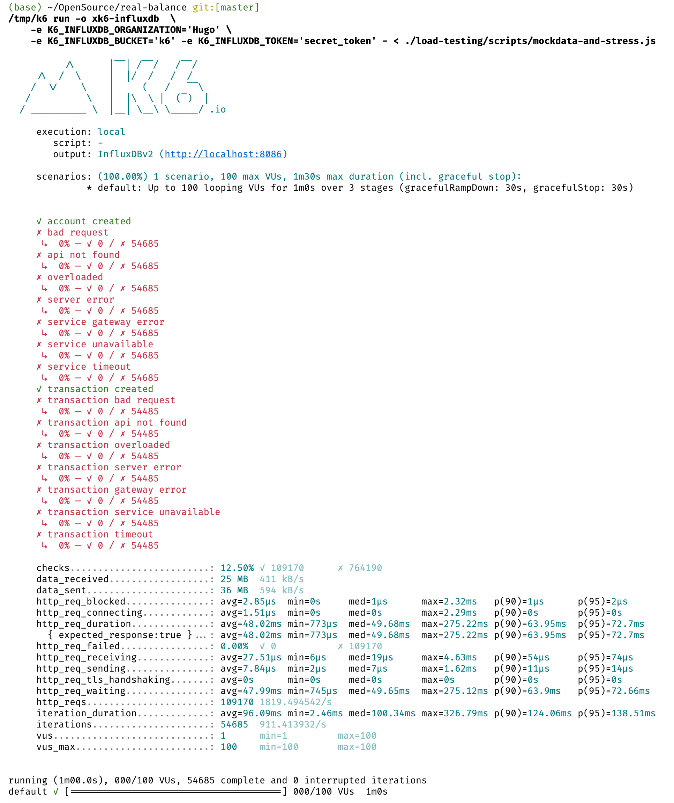
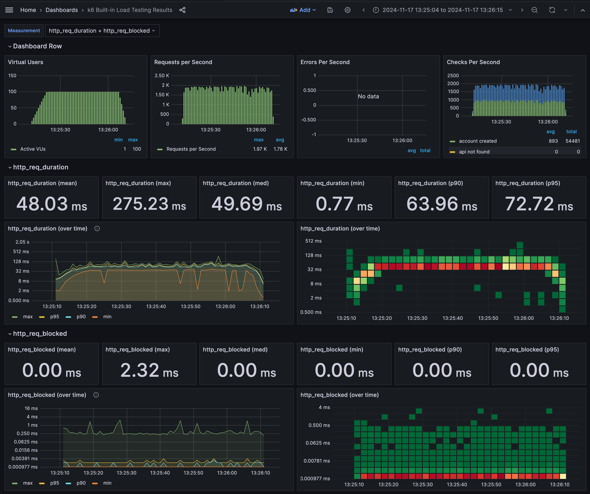

# Performance Benchmark

Performance may vary in different environments. 
This document provides benchmark results of the system in two typical environments.

* **Kubernetes Environment**: Minikube with 4 CPU cores and 8GB RAM.
  * Pods are deployed with 2 replicas given 1 CPU cores and 2GB RAM `Guaranteed` QoS for each.
  * Port forward to Nginx Ingress Controller for load balance against the 2 replicas.
* **Local Environment**: MacBook Pro M2 Max with 10 CPU cores and 32GB RAM.
  * Single instance running local.

In both environment, dependencies are all running in the same environment. Including `Postgres`, `Redis`, and `Kafka`.

Key Server Configuration:
* Tomcat Thread Count: 8

## Kubernetes Environment

After warning up the system, the following results were observed with 100 virtual users:

* TPS: 500
* p(95) latency: 370ms

:warning: **Diagrams below are large and may take a while to load.**

Find the following diagram for more detail for the overall performance:

All requests were processed successfully.

The overall performance during the test is shown in the following diagram:

The system was stable during the test.

## Local Environment

Same test was conducted in local environment with 100 virtual users, the following results were observed:

* TPS: 1800
* p(95) latency: 72ms

Find the following diagram for more detail for the overall performance:

And the diagram version while the test was running:

## Async vs Sync Transaction Processing 

There are two transaction APIs in the system, one is synchronous and the other is asynchronous.

Their performance differences are briefly summarized as following table (in *Local Environment*).

| API   | TPS  | avg latency | p(95) latency |
|-------|------|-------------|---------------|
| Sync  | 1800 | 48          | 72            |
| Async | 4300 | 20          | 36            |

Note: considering the async transaction processing is on the same server, 
the performance can be improved further by splitting out the async process into another service.
