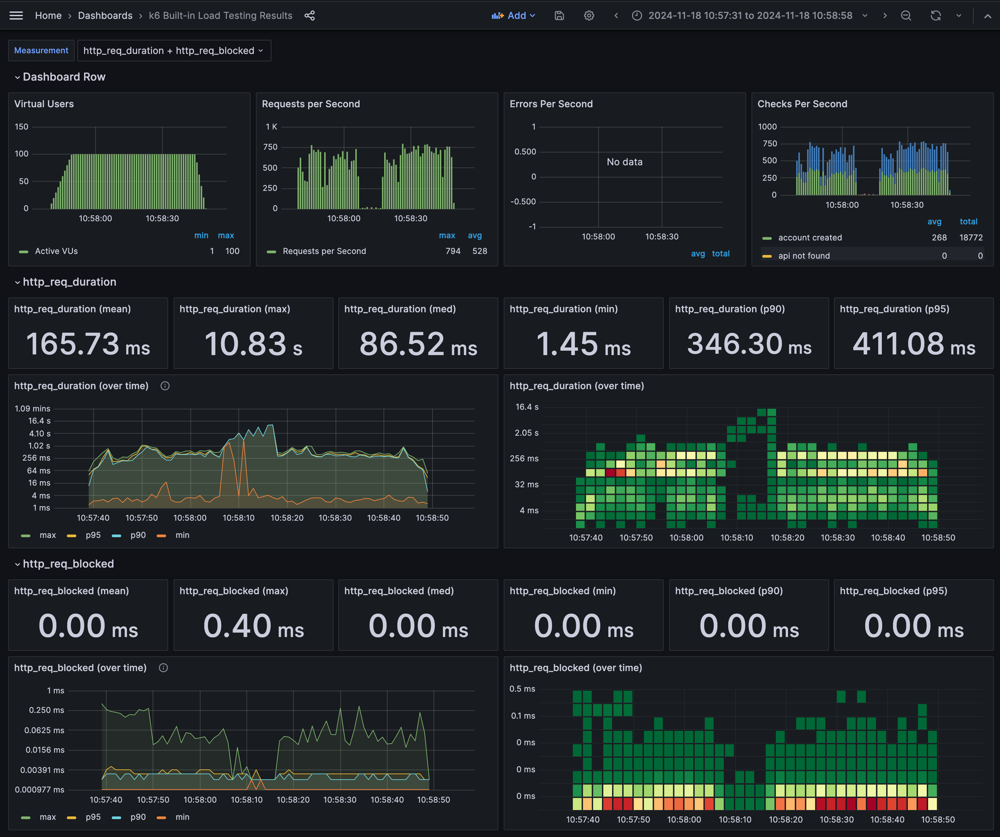

# Resilience Test Report

## Scenarios

There are several key scenarios to be tested for the resilience of the system.

* **Account Service Pod Restart**: The account service pod is restarted, with the help of graceful shutdown and load balancer, the service should be able to recover without any impact.
* **Account Service Database Restart**: The account service database is restarted, the service should be able to recover. Ongoing requests may fail.
* **Account Service Release**: K8S would do rolling release, so there shouldn't be any downtime.
* **Node Restart**: The node where the account service is running is restarted, the service should be able to recover. Ongoing requests may fail.

## Test Tools & Method

The following tools are used for the test:

* [Load Testing Toolset](../load-testing/README.md)
* [K8S Dashboard](DevelopmentEnvironment.md) for manual pod operations. 

## Test Reports

The following table summarized the test results with test methods and outcomes.

| Scenario                         | Test Method                                  | Outcome                                    |
|----------------------------------|----------------------------------------------|--------------------------------------------|
| Account Service Pod Restart      | Manually terminate in K8S dashboard.         | Complete, 10 seconds latency in worse case |
| Account Service Database Restart | Manually terminate in K8S dashboard.         | Complete, 10 seconds downtime.             |
| Account Service Release          | `helm upgrade test ./helm-chart/`            | Complete. No impact observed.              |
| Node Crash                       | bring down a node manually in K8S dashboard. | Incomplete.                                |

### Auto Scaling

While doing stress test, we can see the auto-scaling in action. 
The following diagram shows the auto-scaling of the account service pods.

### Terminate Service Pod

During stress test, we can terminate a pod to see how the system behave.

The pod was terminated in k8s dashboard as following screenshot shows:

The following diagram shows the benchmark result when one pod was terminated.

The pod was terminated at about 20th second during this 60-seconds stress test.

From the diagram, we can tell following fact:

* **TPS drops nearly 50%** after terminate one pod out of the two.
* Ongoing request may **experience longer latency** but the system is still stable (requests still succeed).
* The new pod didn't get fully ready during the test. (It take about 1 minute to startup)

By doing the same test several times, in some cases the latency may go up to nearly 10 seconds, 
and there may also some (about 1% request during that 10 seconds) requests fails with 502 error.

The root cause of the 1% failure rate issue is yet to be identified and resolve. 

### Terminate Service Database

Similar to Service Terminate Test, the following figure shows how the system behave when the database is terminated.

From the diagram, we can tell following fact:
* The service experience a 10 seconds downtime during the db restart
* The service automatically recovered when the database was up online again.

### Node crash

Pod anti-affinity policy was used in account service, so pods are not scheduled on the same node. 
When a node was crashed, the pods on that node should be rescheduled to other nodes.
In that case, this scenario would be similar to the pod crash scenario on the same node. 

Due to the limitation of the local environment, this scenario was not tested.
