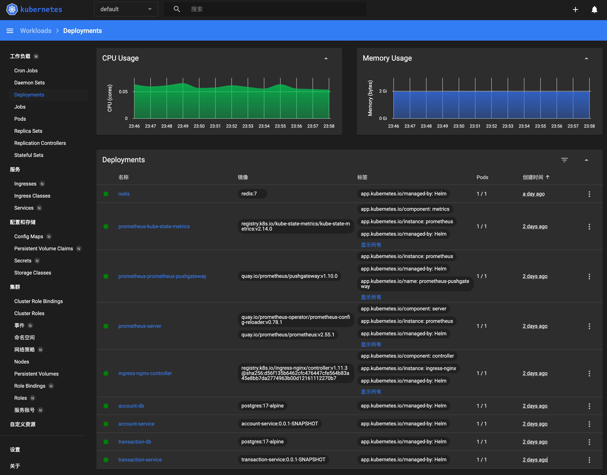

# Helm Chart for Kubernetes Deployment

This is a Helm chart for deploying the Real-Time Balance application to a Kubernetes cluster.

It can be used to deploy the application to a local Minikube cluster or a cloud-based Kubernetes cluster.

* In local deployment, a local database and redis will be deployed as well.
* In cloud deployment, a managed database and redis service should be used.

## Local Deployment

Assuming the `default` namespace is used. 

* Deploy 
```bash
helm install test ./helm-chart/ -f ./helm-chart/values.yaml --namespace default
```
* Check status
```bash
helm list -n default
kubectl get all -n default
# This will open a kubernetes dashboard in browser.
minikube dashboard
# If you use Kubernetes of Docker Desktop, you may need to install K8S Dashboard.
kubectl apply -f https://raw.githubusercontent.com/kubernetes/dashboard/v2.7.0/aio/deploy/recommended.yaml
kubectl proxy
open http://localhost:8001/api/v1/namespaces/kubernetes-dashboard/services/https:kubernetes-dashboard:/proxy/
```
Once deployed successfully, your dashboard should show something like this:


* Upgrade if case of any helm update
```bash
helm upgrade test ./helm-chart/ -f ./helm-chart/values.yaml --recreate-pods -n default
```
* Tear down
```bash
helm uninstall test -n default
```

### Expose the service in Helm

After deployment, you may want to expose them to the host machine for testing purpose.

* Expose the service to local
    ```bash
    kubectl port-forward svc/account-db 5433:5432
    kubectl port-forward svc/transaction-db 5434:5432
    kubectl port-forward svc/account-service 8082:8080
    kubectl port-forward svc/account-service 9010:9010
    kubectl port-forward svc/transaction-service 8081:8080
    kubectl port-forward svc/ingress-nginx-controller 8080:80
    ```
  OR using minikube if the k8s cluster was in local.
    ```bash
    minikube service account-service --url
    ```

Please note, if you connect to svc/account-service, only one of the account-service will be connected.

### Stability Tweaks

#### Pod QoS Class

The pod [QoS class](https://kubernetes.io/docs/concepts/workloads/pods/pod-qos/) should be `Guaranteed` or `BestEffort` for the account-service and transaction-service pods. 
This ensures that the pods are not evicted from the node due to resource constraints.

#### Pod Anti-Affinity

Pod anti-affinity is set to `required` for the account-service and transaction-service pods.
So that the pods are not scheduled on the same node.

It only works if there are multiple nodes in the cluster.

## To-Dos

* Split helm-chart into two charts for app service & shared infrastructure respectively.
