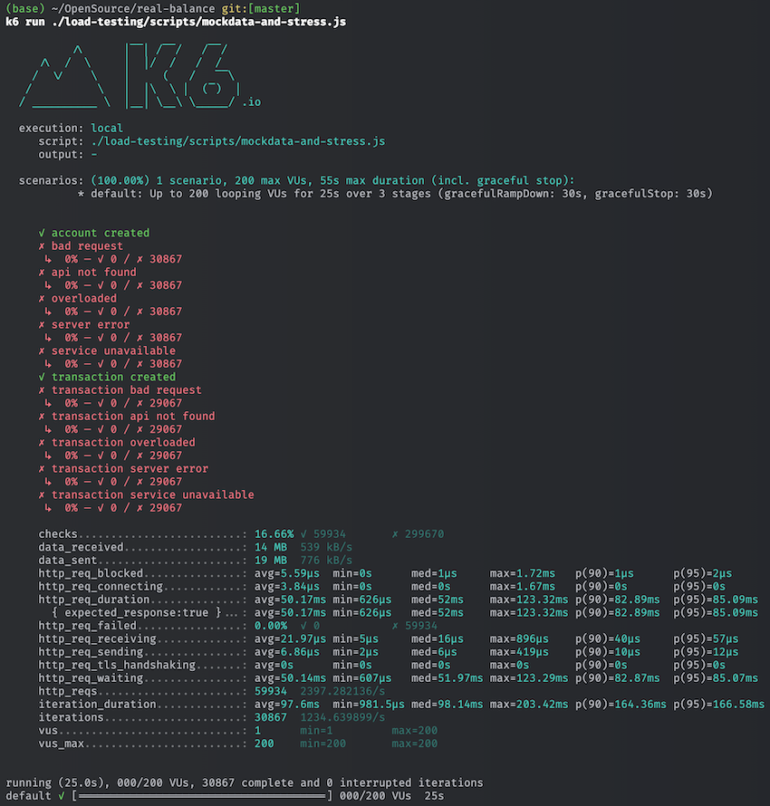

# Stress Test Suite

## Pre-requisites & Setup

Refers to [Environment Setup](../docs/DevelopmentEnvironment.md) for the required tools and setup.

## Basic Use Cases

Basic stress test with k6 helps benchmark API performance with customized request pattern on heavy load.
It can also be used to populate massive amount of customizable data to the system for testing.

### Run Load Testing with K6

Bring up a local instance of the `account-service` and run the load testing script.

   ```shell
   k6 run ./load-testing/scripts/mockdata-and-stress.js
   ```

You will see something like this:


In the figure above, it shows a result of a stress test lasting 25 seconds and 60K request was processed during that time. 

The TPS of account-service is around 2400 and the p(95) latency is 85ms (in my local environment).

### Run Resilience Testing with K6

Take down the whole service while running a stress test to see how the system behaves.

   ```shell
   k6 run -e TARGET_HOST=http://localhost:8080 -e ENABLE_CHAOS_MONKEY=true ./load-testing/scripts/mockdata-and-stress.js
   ```

:warning: Please note thus test is only feasible for helm chart deployment. 

### Built-in Scripts

There are some built-in scripts in the `./load-testing/scripts` directory. You can use them directly.

* **mockdata-and-stress.js**: This script create account and make transaction between those account randomly with 100 vu (virtual user).
* **create-account-stress.js**: This script only perform create accounts request with 100 concurrent vu.

## Advanced Use Cases with Diagrams

## Build a customized K6 with InfluxDB V2 Output Plugin

The official release of K6 does not support InfluxDB V2 output plugin. 
Need to build a customized k6 executable with InfluxDB output plugin.

This component can be a shared library for all projects that need to run load testing with InfluxDB.

### How to Build

1. Build a customized k6 executable with InfluxDB output plugin. (:warning: This may require VPN to download images)
    ```shell
    docker build --build-arg PLUGIN=grafana/xk6-output-influxdb -t k6-influxdb ./load-testing/k6
    ```
1. Or you can build k6 binary in local (Requires go installed)
   ```shell
   go install go.k6.io/xk6/cmd/xk6@latest
   export PATH=$(go env GOPATH)/bin:$PATH
   xk6 build --with "github.com/grafana/xk6-output-influxdb" --output /tmp/k6
   ```

### How to Run

1. Bring up prometheus, influxdb and grafana services.
    ```shell
    docker-compose up -d
    ```
1. Execute test scripts in `./scripts` directory. You can update the scripts as needed.
   ```shell
    /tmp/k6 run -o xk6-influxdb  \
    -e K6_INFLUXDB_ORGANIZATION='Hugo' \
    -e K6_INFLUXDB_BUCKET='k6' -e K6_INFLUXDB_TOKEN='secret_token' - < ./load-testing/scripts/mockdata-and-stress.js
   ```
   OR run from docker (:warning: need to update the address in script to make it accessible from local)
   ```shell
   docker run --network="host" --rm -i k6-influxdb run -o xk6-influxdb \
   -e K6_INFLUXDB_ORGANIZATION='Hugo' \
   -e K6_INFLUXDB_BUCKET='k6' -e K6_INFLUXDB_TOKEN='secret_token' - < ./load-testing/scripts/create-account-stress.js
   ```

### How to Monitor / Analyze

1. Check test result and performance metrics.
   * Access [built-in dashboard](http://localhost:3000/d/dba00ead-0f0a-4c1d-a3f6-505d886ab946/k6-built-in-load-testing-results?orgId=1&refresh=5s)
      * Access Prometheus: http://localhost:9090
      * Access InfluxDB: http://localhost:8086
        * Login with root/password
   * [Optional] Import new dashboard from Grafana
     * [K6-Prometheus dashboard](https://grafana.com/grafana/dashboards/19665-k6-prometheus/)
     * [K6 Load Testing Result dashboard](https://grafana.com/grafana/dashboards/2587-k6-load-testing-results/)
   * Import more useful dashboards from [Grafana marketplace](https://grafana.com/grafana/dashboards/).
